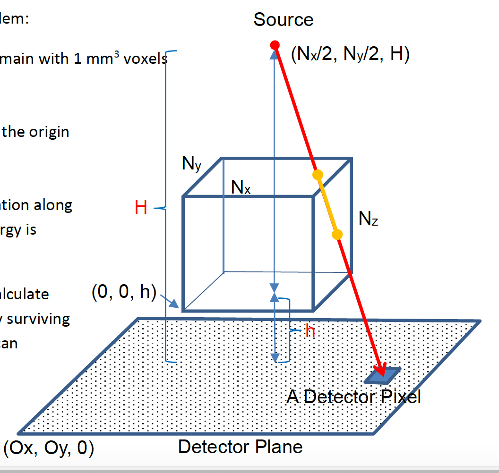

# xrayscanner
The code in this repository was meant to simulate an imaging scenario describe in thie picture given. All the variables given are parameters for the imaging function. A matrix of linear attenuation coeffcients is given representing the imaging object(headct.h5). The code that simulates the imaing scenario is bio.py. In this script the imaging object is created, the energy at each detector pixel is calculated and then saved to a numpy save file. This code has been accelerated through the use of Numba which provided around 100x speed up over a pure python version. A script is given to plox out the results of the bio.py script plot_x.py which will plot out the detector and log of the detector for this calculated version in numpy and a matlab oracle version.    
  
